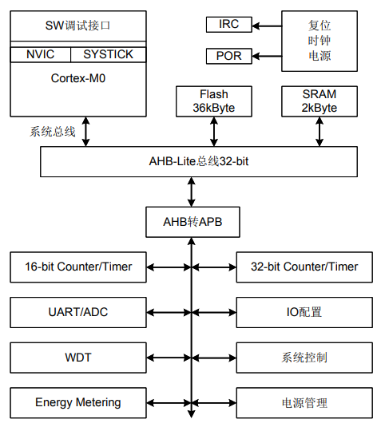

# [ESEM16](https://github.com/SoCXin/ESEM16)

#### [Vendor](https://github.com/SoCXin/Vendor) ：[Eastsoft](http://www.essemi.com/)
#### [Core](https://github.com/SoCXin/Cortex)：[Cortex M0](https://github.com/SoCXin/CM0)
#### [Level](https://github.com/SoCXin/Level) ：20MHz * 0.95DMIPS/MHz

## [ESEM16简介](https://github.com/SoCXin/ESEM16/wiki)

[ESEM16](https://github.com/SoCXin/ESEM16) 32K+2K存储,两个16位定时器,一路UART,一个32位定时器,支持ISP，IAP，SWD功能。

* 工作电压范围：3.0V ~ 3.6V
* 工作电流1：计量关闭模式Ivdd <3.5mA
* 工作电流2：计量打开模式 Ivdd <6mA
* 工作主时钟频率：10MHz/20MHz
* 12个双向I/O端口，支持12路外部中断输入，触发方式可配置
* 36KB Code Flash （Data Flash可选）
* 2KB SRAM
* 支持ISP，IAP，SWD功能
* 两个16位定时器，一个32位定时器 ：定时器/计数器，带预分频器，扩展输入捕捉/输出调制功能
* 一路UART
* ADC：12位精度，10通道
* 电能计量：

差分输入信号范围±600mV
*  有功电能和信号有效值计量：

1.有功电能计量误差小于0.1%，动态范围为1000：1（@ 25℃）
2.一路电流和一路电压有效值测量误差小于1%，动态范围为500：1（@ 25℃）
*  电参量测量：有功功率、电压、电流、相角
*  电参量校准：有功增益校准、有功失调补偿、角差校准、电流/电压有效值增益校准，并支持单步完成所有电参量校准
*  电表常数可调
*  起动与潜动功率门限值可配置
*  有功电能脉冲CF输出可配置

#### 关键特性

* 差分输入信号范围±600mV
* 有功电能计量误差小于0.1%，动态范围为1000：1（25℃）
* 一路电流和一路电压有效值测量误差小于1%，动态范围为500：1（25℃）

### [资源收录](https://github.com/SoCXin)

* [参考文档](docs/)
* [参考资源](src/)
* [参考工程](project/)

### [选型建议](https://github.com/SoCXin)

[ESEM16](https://github.com/SoCXin/ESEM16) 应用于智能插排、计量电表、充电桩等领域

电表应用类计量SoC

* [RN8613](https://github.com/SoCXin/RN8613)
* [RN8213](https://github.com/SoCXin/RN8213)
* [HT5027](https://github.com/SoCXin/HT5027)

###  [www.SoC.xin(芯)](http://www.SoC.Xin)
